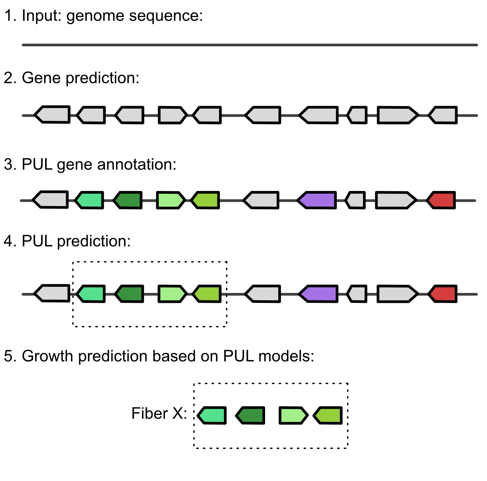

# FiberGrowt


## Short description

FiberGrowth allows to detect specific Polysaccharides Utilization Loci (PUL) from strain's genome. 




## Usage

```
Rscript FiberGrowth.R [options] --out=<output_folder> --gff=<gff_file> --proteins=<fasta_file>

Rscript FiberGrowth.R [options] --out=<output_folder> --genome=<fasta_file>

Rscript FiberGrowth.R (-h | --help)

Options:
  --gff=<gff_file>                          Gene locations in gff format.
  --proteins=<fasta_file>                   Amino acid sequences in fasta format.
  --genome=<fasta_file>                     Genome in fasta format.
  --lib=<path_to_library>                   Path to library of PUL models
                                            [default: PUL_models in installation directory].
  --out=<output_folder>                     Output directory (will be created).
  --gffFeatureName=<gffFeatureName>         Name of feature to use in gff file [default: CDS]
  --gffAttributeKey=<gffAttributeKey>       Name of attribute key to use in gff file [default: Name]
  -t --threads=<threads>                    Number of threads to run [default: 1].
  -h, --help                                Show help.

```

## Installation

### Dependencies

  - Hmmer (>3.1b2) (http://hmmer.org)
  - Prodigal (>2.6.3) (https://github.com/hyattpd/Prodigal)
  - Pandoc (>2.14)
  - R (>4)
  - R packages:
      - data.table
      - DT
      - docopt
      - gggenes
      - ggplot2
      - knitr
      - magrittr
      - rhmmer
      - rmarkdown


## Quick start

Running FiberGrowth on a given genome sequence in fasta format:
```
Rscript FiberGrowth.R --out=fibergrowth_output --genome=genome.fasta

```

Alternatively, FiberGrowth can be run on amino acid sequences in fasta format and gene locations in gff format:
```
Rscript FiberGrowth.R --out=fibergrowth_output --gff=genome.gff --proteins=proteins.faa

```

## Example: Predicting PULs on *B. thetaiotaomicron* VPI-5482

Download the assembly of [*Bacteroides thetaiotaomicron* VPI-5482](https://www.ncbi.nlm.nih.gov/assembly/GCF_000011065.1) from NCBI:
```
curl https://ftp.ncbi.nlm.nih.gov/genomes/all/GCF/000/011/065/GCF_000011065.1_ASM1106v1/GCF_000011065.1_ASM1106v1_genomic.fna.gz | gunzip > GCF_000011065.1_ASM1106v1_genomic.fna
```

Run FiberGrowth:
```
Rscript FiberGrowth.R --out=example --genome=GCF_000011065.1_ASM1106v1_genomic.fna
```

Inspect the output:
For each fiber a table with candidate PULs is created:
```
# list all tables:
ls -l example/fibergrowth
# inspect results for heparin:
less example/fibergrowth/gn_heparin_fibergrowth.tsv
```

In addition, a report in html format is generated:
```
example/FiberGrowthReport.html
```


## Custom PUL models

It is possible to run FiberGrowth with custom PUL models in addition to the models in [PUL_models](https://github.com/wholebiome/FiberGrowth/tree/main/PUL_models). The following files are required:

- **protein_families.hmm**: HMMs representing the protein families of the PUL. HMMs can be custom build using `hmmbuild` ([HMMER3](http://hmmer.org) package) or retrieved from [PFAM](http://pfam.xfam.org). Each HMM requires the following tags in the header section:
   - *NAME*: A unique name of the protein family model.
   - *GA*: Gathering thresholds. Hits with a score below *GA* will be ignored.


- **.h3i**, **.h3f**, **.h3p**, **.h3m**: In order to be used in FiberGrowth, `hmmpress` ([HMMER3](http://hmmer.org) package) has to be applied on the `protein_families.hmm` file.


- **pathway_table.tsv**: A tab separated file containing the metadata of the PUL model with the columns:
   - *HmmID*: Name of the protein family. Has to match the *NAME* tag in the respective HMM.
   - *PathwayName*: Name of the pathway/PUL.
   - *Position*: Position of the gene in the PUL.
   - *RefStrand*: Orientation of the gene (not used in the current implementation).
   - *GeneName*: Name of the gene. Will be included in output tables and plots.
   - *Weight*: Indicates core genes. A PUL will only be reported if all genes with *Weight* == 1 are present. Set *Weight* to 0 for all genes to report all PULs above *MinSize* independently of composition.
   - *MinSize*: Minimum gene number required for a PUL to be reported.


All files have to be stored in a directory with a name matching the *PathwayName*. For each PUL model, a separate directory is required. See  [PUL_models](https://github.com/wholebiome/FiberGrowth/tree/main/PUL_models) for examples. For more details on HMMs, please see the [HMMER3 documentation](http://hmmer.org/documentation.html).

## References

Besides custom built protein HMMs, FiberGrowth uses HMMs retrieved from Pfam (http://pfam.xfam.org; [El-Gebali et al., 2019](https://academic.oup.com/nar/article/47/D1/D427/5144153)). The HMMs are part of this repository and can be found in the PUL_models subdirectory.
